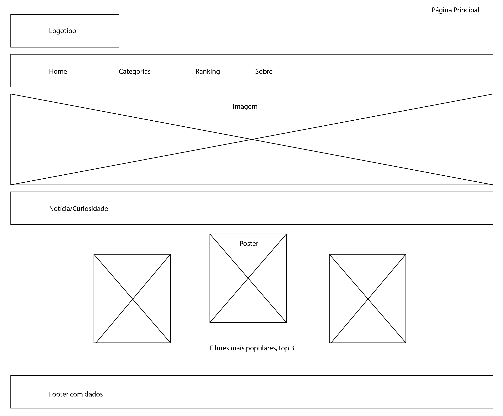
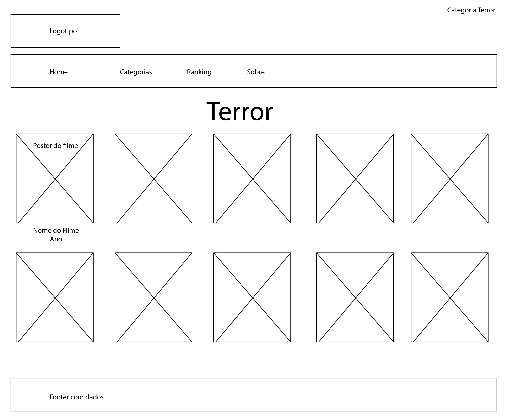
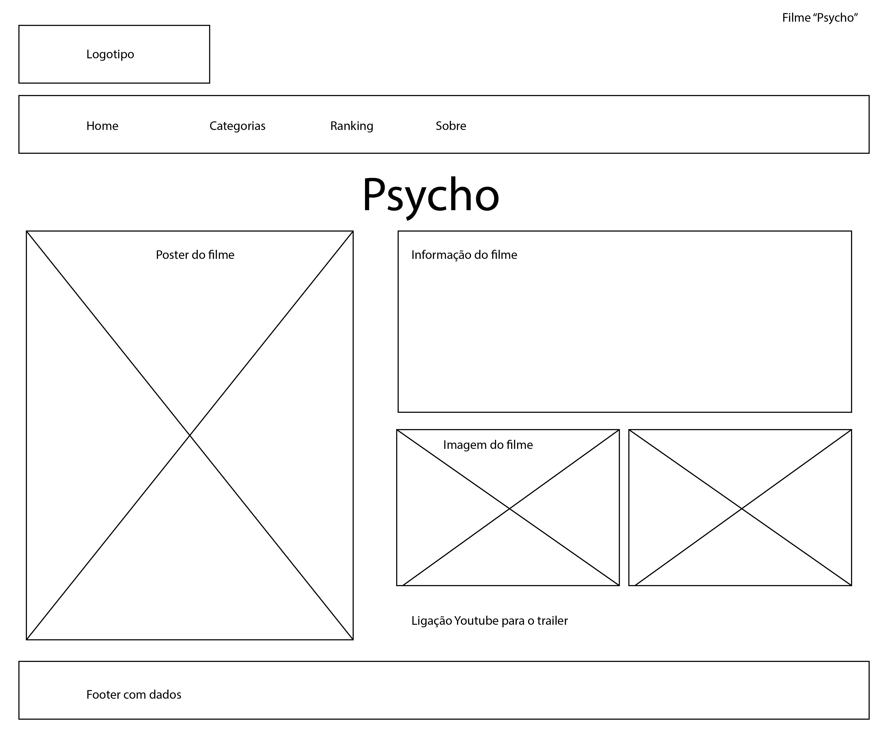
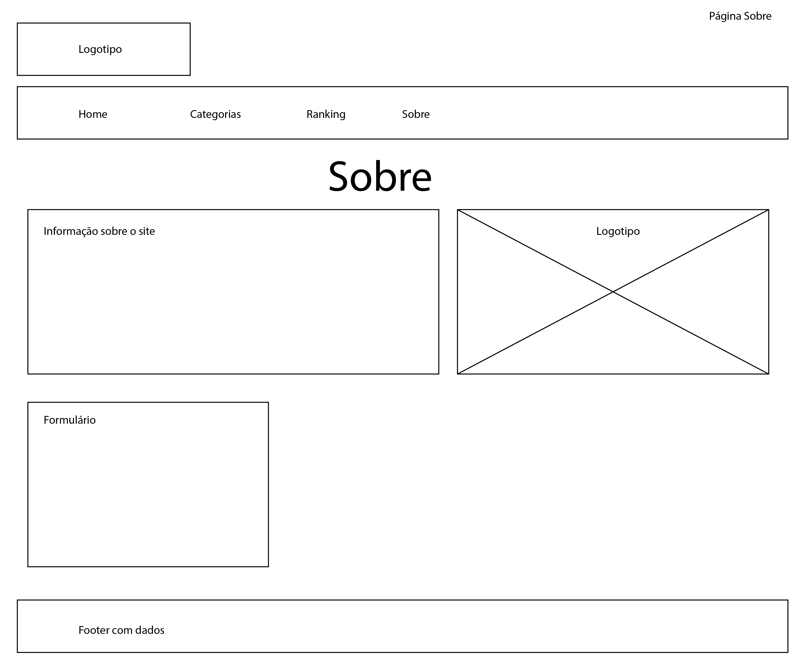
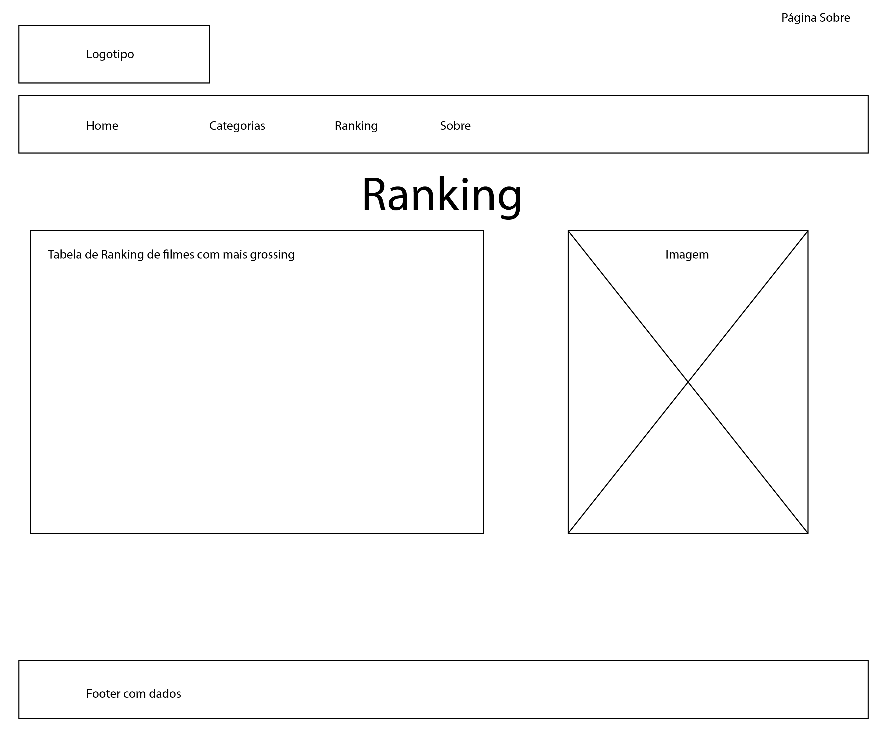
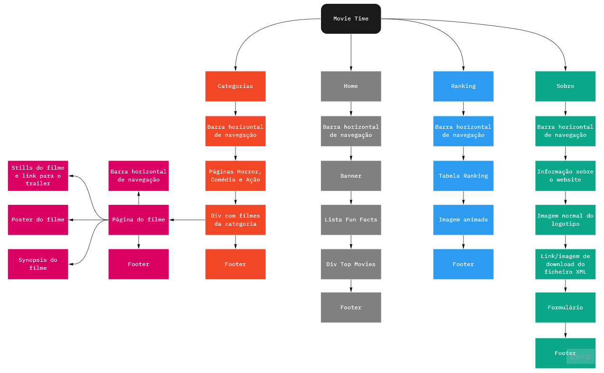
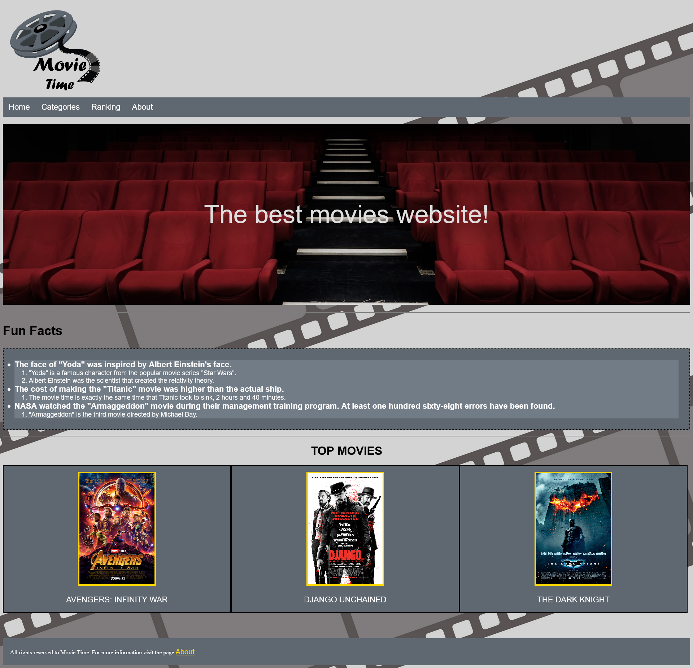
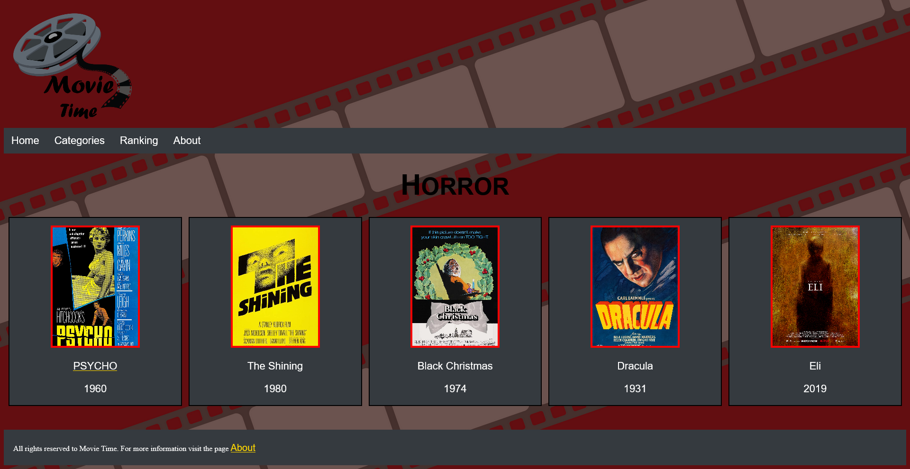

# C2: Interface de Utilizador

## Interface

### Sketch

Sketch da página principal.

Sketch de uma página de categorias.

Sketch de uma página de um filme específico.

Sketch da página "About".

Sketch da página "Ranking".

## Sitemap

Sitemap realizado tendo em conta a estrutura do website.

## Resultado final e comparação com o estudio inicial

### Página Home

O resultado final manteve-se bastante fiel ao plano inicial feito no sketch. A única diferença foi o local onde está situada a imagem central do Top Movies, que no sketch situava-se ligeiramente acima.
 

### Página de uma das categorias (Horror, Comédia e Ação)

A única diferença presente é o número de filmes disponíveis em cada linha horizontal. Invês de ter dez têm cinco, pois consideramos que ficava muito sobrecarregado de informação e optamos assim por reduzir porque o utilizador consegue ver mais facilidade os posters dos filmes.

<table>
<thead>
<tr>
<th align="left"><a href="https://github.com/TCM-TW02/trabalhofinal/blob/main/docs/c1.md">&lt; Previous</a></th>
<th align="center"><a href="https://github.com/TCM-TW02/trabalhofinal#report">^ Main</a></th>
<th align="right"><a href="https://github.com/TCM-TW02/trabalhofinal/blob/main/docs/c3.md">Next &gt;</a></th>
</tr>
</thead>
</table>

