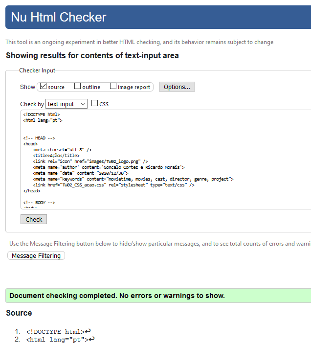

# C3: Produto

## Descrição

Produto criado com amantes do cinema em mente. Informação sobre vários filmes de modo a aumentar a sua cultura do cinema.

### 3.1 Instruções de instalação e configuração

- Fazer o download do .zip a partir do [GitHub](https://github.com/TCM-TW02/trabalhofinal);
- Utilizar o programa ["Visual Studio Code"](https://code.visualstudio.com/) para aceder ao código da forma entendida; 
- No "Visual Studio Code" fazer o download da extensão ["Live Server"](https://marketplace.visualstudio.com/items?itemName=ritwickdey.LiveServer) de modo a conseguir aceder ao website via servidor a tempo real, pois assim consegue visualizar o conteúdo de forma correta;
- Abrir ficheiro "TW02_html.html" e clicar em "Go Live";
- Disfrutar do website.

### 3.2 Regras de Utilização

- Apenas pode ser acedido a partir do computador (Firefox recomendado) e mobile, nomeadamente iPhone 6/7/8 iOS 11 pois o website com criado com estas duas medidas em mente.

### 3.3 Ajuda à navegação

Todas as páginas dispõe de um menu horizontal onde o utilizador pode clicar em qualquer uma das opções desejada. Na opção "Categories", um sub-menu aparece assim que passar o rato por cima, permitindo aceder a três categorias de filmes diferentes. Cada categoria está associada a um esquema de cores de modo a identificar os filmes que fazem parte da mesma.

"Tooltips"
Informações sobre como utilizar este site não existem pois o próprio site é feito de maneira simples e de fácil compreensão. Na página principal está tudo dividido, não consideramos necessário criar um tutorial visto que se ia tornar mais confuso para o utilizador.

### 3.4 Formulários (Validações)

Neste website o formulário incluído na página "About" não está a ser validado.

### 3.5 Validação do HTML e CSS

- A validação do HTML e CSS foi feita no website ["W3C Markup Validation Service"](https://validator.w3.org/);

Adicionalmente, a validação do XML foi feita no website ["XML Validation"](https://www.xmlvalidation.com/).

Resultados da validação de cada página HTML:

- TW02_HTML.html

- TW02_HTML_horror.html

- TW02_HTML_comedia.html

- TW02_HTML_acao.html

- TW02_HTML_acao.html

- TW02_HTML_psycho.html

- TW02_HTML_parasite.html

- TW02_HTML_darkknight.html

- TW02_HTML_ranking.html

- TW02_HTML_sobre.html

Resultados da validação de cada página CSS:

- TW02_CSS.css

### 3.6 Detalhes de implementação

Todos os objetivos mínimos pedidos no enunciado do projeto foram atingidos como é possível verificar em cada uma das páginas do website, adicionando sempre uma particularidade extra.

Em termos de elementos extra, adicionamos propriedades CSS3 como "transiction" no menu horizontal em cada página, onde ao passar o rato por cima a cor muda lentamente, e também adicionamos uma "animation" na página "Ranking", onde a imagem aumenta até um certo valor.

<table>
<thead>
<tr>
<th align="left"><a href="https://github.com/TCM-TW02/trabalhofinal/blob/main/docs/c2.md">&lt; Previous</a></th>
<th align="center"><a href="https://github.com/TCM-TW02/trabalhofinal#report">^ Main</a></th>
<th align="right"><a href="https://github.com/TCM-TW02/trabalhofinal/blob/main/docs/c4.md">Next &gt;</a></th>
</tr>
</thead>
</table>

